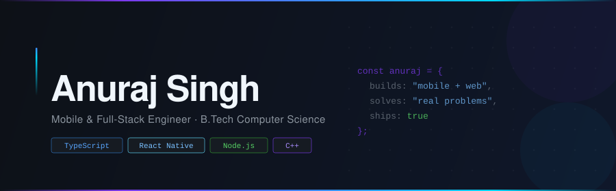

<!-- ============================================================
     ANURAJ SINGH — GitHub Profile README
     its-anuraj | Banner: committed SVG (no external service)
     ============================================================ -->

<div align="center">

<!-- Custom banner — served directly from repo, always loads -->


<br/>

<!-- Typing animation -->
<a href="https://github.com/its-anuraj">
  
</a>

<br/><br/>

<a href="https://github.com/its-anuraj"></a>
&nbsp;
<a href="https://www.linkedin.com/in/anuraj-singh-47330030a/"></a>
&nbsp;
<a href="https://anuraj-singh.vercel.app/"></a>
&nbsp;
<a href="mailto:ajsinghindolia@gmail.com"></a>
&nbsp;


</div>

<br/>

---

## &nbsp;`~/whoami`

```typescript
const anuraj: Developer = {
  degree   : "B.Tech — Computer Science & Engineering",
  building : ["Cross-platform mobile apps", "Full-stack web systems"],
  exploring: ["AI/ML integration", "Cloud infrastructure"],
  mindset  : "Ship things that work. Then make them scale.",
};
```

CS undergraduate who builds software that solves actual problems.
My projects live at the intersection of **mobile-first product thinking**, **robust backend design**, and **AI-powered features**.
Currently going deep on full-stack architecture and sharpening algorithmic fundamentals — because good engineers understand systems from both ends.

---

## &nbsp;`~/stack`

<div align="center">

<table>
<tr><td align="center" width="160"><b>Languages</b></td><td>

</td></tr>
<tr><td align="center"><b>Mobile</b></td><td>

&nbsp;<code>React Native</code> &nbsp;<code>Expo</code>
</td></tr>
<tr><td align="center"><b>Frontend</b></td><td>

&nbsp;<code>React</code>
</td></tr>
<tr><td align="center"><b>Backend</b></td><td>

&nbsp;<code>Node.js</code> &nbsp;<code>REST APIs</code>
</td></tr>
<tr><td align="center"><b>Tooling</b></td><td>

</td></tr>
<tr><td align="center"><b>Exploring</b></td><td>

&nbsp;<sub><code>Cloud · AI/ML</code></sub>
</td></tr>
</table>

</div>

---

## &nbsp;`~/projects`

<div align="center">
<table>
<tr>
<td width="50%" valign="top" style="padding:12px">

**🤖 [CampusHub-AI](https://github.com/its-anuraj/CampusHub-AI)**

AI-powered campus utility platform — an intelligent companion that streamlines student workflows using AI integration.

`TypeScript` `React Native` `AI/ML` `Expo`

</td>
<td width="50%" valign="top" style="padding:12px">

**🚨 [SERS](https://github.com/its-anuraj/SERS)**

Smart Emergency Response System — bridges the gap between crisis detection and coordinated real-time response.

`JavaScript` `Node.js` `Real-Time`

</td>
</tr>
<tr>
<td width="50%" valign="top" style="padding:12px">

**🌍 [Disaster-Alert](https://github.com/its-anuraj/Disaster-alert)**

Mobile-first disaster alerting with geolocation-aware push notifications. Designed around urgency and offline resilience.

`React Native` `Expo` `Geolocation`

</td>
<td width="50%" valign="top" style="padding:12px">

**⚡ [DSA in Java](https://github.com/its-anuraj/DSA-in-java-LeetCode-Solutions)**

Structured LeetCode solutions in Java covering arrays, graphs, trees, and dynamic programming. A long-term CS fundamentals reference.

`Java` `LeetCode` `Algorithms`

</td>
</tr>
</table>
</div>

<div align="center">
<sub>Also built:&nbsp;
<a href="https://github.com/its-anuraj/My-Portfolio"><b>My Portfolio</b></a>&nbsp;·&nbsp;
<a href="https://github.com/its-anuraj/hackindia-spark-4-ncr-east-region-bit-rebels"><b>HackIndia 2024 — NCR East</b></a>
</sub>
</div>

---

## &nbsp;`~/analytics`

<div align="center">


&nbsp;&nbsp;


<br/>


</div>

---

## &nbsp;`~/activity`

<div align="center">

</div>

---

## &nbsp;`~/contributions`

<div align="center">
<picture>
  <source media="(prefers-color-scheme: dark)"  srcset="https://raw.githubusercontent.com/its-anuraj/its-anuraj/output/github-snake-dark.svg"/>
  <source media="(prefers-color-scheme: light)" srcset="https://raw.githubusercontent.com/its-anuraj/its-anuraj/output/github-snake.svg"/>
  
</picture>
</div>

---

## &nbsp;`~/dsa`

<div align="center">


<br/><br/>

<a href="https://leetcode.com/u/Anuraj_singh_indolia/">
  
</a>
&nbsp;
<a href="https://github.com/its-anuraj/DSA-in-java-LeetCode-Solutions">
  
</a>

</div>

---

## &nbsp;`~/connect`

<div align="center">

<a href="https://github.com/its-anuraj">
  
</a>
&nbsp;
<a href="https://www.linkedin.com/in/anuraj-singh-47330030a/">
  
</a>
&nbsp;
<a href="https://anuraj-singh.vercel.app/">
  
</a>
&nbsp;
<a href="mailto:ajsinghindolia@gmail.com">
  
</a>

</div>

---

<div align="center">
<br/>
<sub>
<code>Building</code> &nbsp;·&nbsp; <code>Learning</code> &nbsp;·&nbsp; <code>Shipping</code>
</sub>
<br/><br/>
</div>
